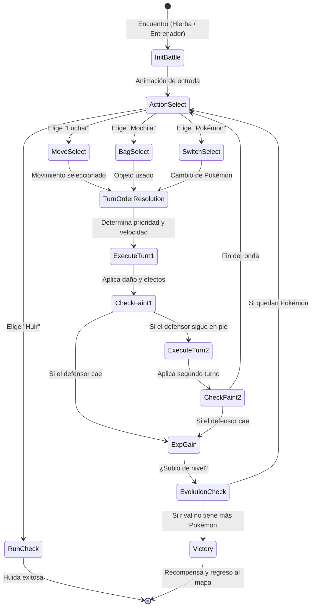

# 🎮 Documento Maestro de Diseño y Desarrollo: Pokémon Fangame (.exe Local)

> **Tipo de Proyecto:** Fangame RPG Pokémon en modo local independiente (.exe)  
> **Estilo Visual:** 2.5D / HD-2D estilizado (Intermedio entre GBA y Switch / Estilo NDS Gen 5 + Shaders modernos)  
> **Conectividad:** 100% Offline (Datos extraídos y cacheados previamente de la PokéAPI)  
> **Plataforma Objetivo:** Windows (Empaquetado como ejecutable directo `.exe`)

---

## 📑 Tabla de Contenidos

1. [Visión General y Pilares del Juego](#1-visión-general-y-pilares-del-juego)
2. [Stack Tecnológico y Motor Recomendado](#2-stack-tecnológico-y-motor-recomendado)
3. [Pipeline de Datos: Extracción de PokéAPI a Base Local](#3-pipeline-de-datos-extracción-de-pokéapi-a-base-local)
4. [Dirección de Arte y Estilo Visual (El Punto Medio)](#4-dirección-de-arte-y-estilo-visual-el-punto-medio)
5. [Arquitectura del Sistema de Juego](#5-arquitectura-del-sistema-de-juego)
   - [5.1 Motor de Batalla por Turnos](#51-motor-de-batalla-por-turnos)
   - [5.2 Overworld y Exploración 2.5D](#52-overworld-y-exploración-25d)
   - [5.3 Sistema de Narrativa, Eventos y Diálogos](#53-sistema-de-narrativa-eventos-y-diálogos)
   - [5.4 Menús, Inventario y Gestión de Equipo](#54-menús-inventario-y-gestión-de-equipo)
   - [5.5 Sistema de Guardado y Carga (.sav)](#55-sistema-de-guardado-y-carga-sav)
6. [Estructura del Proyecto y Carpetas](#6-estructura-del-proyecto-y-carpetas)
7. [Script de Extracción Automatizada (PokéAPI Pipeline)](#7-script-de-extracción-automatizada-pokéapi-pipeline)
8. [Fórmulas Matemáticas Clave del Combate](#8-fórmulas-matemáticas-clave-del-combate)
9. [Roadmap de Desarrollo Paso a Paso](#9-roadmap-de-desarrollo-paso-a-paso)
10. [Guía de Compilación y Exportación a `.exe`](#10-guía-de-compilación-y-exportación-a-exe)

---

## 1. Visión General y Pilares del Juego

El objetivo es crear un juego de rol (RPG) por turnos que combine la **nostalgia y profundidad estratégica** de los clásicos de consola portátil con **tecnologías gráficas modernas**:

```
+-------------------------------------------------------------------------------+
|                             PILARES DEL PROYECTO                              |
+-------------------------------------------------------------------------------+
|  1. RENDIMIENTO LOCAL: Sin llamadas web en vivo, 60 FPS estables, carga cero. |
|  2. IDENTIDAD NARRATIVA: Historia original, nueva región, personajes y rutas. |
|  3. ESTÉTICA ELEVADA: Sprites 2D animados en mundos 2.5D con iluminación real.|
|  4. COMBATE PRECISO: Sistema de daño, tipos, naturalezas y stats oficiales.   |
+-------------------------------------------------------------------------------+
```

---

## 2. Stack Tecnológico y Motor Recomendado

Para exportar un ejecutable `.exe` nativo y conseguir el estilo visual deseado, las mejores opciones son:

### Opción Principal (Recomendada): **Godot Engine 4.x (GDScript / C#)**
* **¿Por qué?**:
  * Motor gratuito, de código abierto, ultraligero (< 100 MB).
  * Soporte nativo para 2.5D, Tilemaps avanzados con capas Y-Sort, shaders de iluminación 2D (`CanvasModulate`, luces puntuales, sombras suaves).
  * Exportación nativa a `.exe` para Windows con un solo clic.
  * Manejo excelente de JSON, archivos binarios y base de datos SQLite integrada.

### Opción Alternativa 1: **Tauri + Vite + Phaser.js / PixiJS (TypeScript / Web Stack)**
* **¿Por qué?**: Ideal si tienes experiencia con HTML5, Canvas y TypeScript. Se empaqueta con **Tauri** para generar un `.exe` con el rendimiento nativo de Rust y un consumo de RAM mínimo (< 40 MB).

### Opción Alternativa 2: **Unity (Universal Render Pipeline - URP)**
* **¿Por qué?**: Si se busca un estilo **HD-2D puro** con cámara con profundidad de campo (*Tilt-Shift* / desenfoque cinematográfico), iluminación volumétrica y partículas complejas.

---

## 3. Pipeline de Datos: Extracción de PokéAPI a Base Local

La PokéAPI (`pokeapi.co`) no debe consumirse durante la partida. Se utiliza un **proceso de extracción (ETL)** que descarga y estructura la información en archivos locales.

```
+------------------+         +-------------------------+         +-------------------------+
|  PokéAPI REST    |         | Script Extractor        |         | Assets Locales (.exe)   |
|  (Endpoints Web) | =======>| (Python / Node.js)      | =======>| - /data/pokedex.json    |
|                  |         | - Limpia datos          |         | - /data/moves.json      |
|  - /pokemon/{id} |         | - Filtra generaciones   |         | - /data/types.json      |
|  - /move/{id}    |         | - Descarga sprites GIF  |         | - /assets/sprites/...   |
|  - /type/{id}    |         | - Optimiza peso         |         | - /assets/audio/...     |
+------------------+         +-------------------------+         +-------------------------+
```

### Datos requeridos por Pokémon:
* `id`, `name`, `types` (ej. `["Fire", "Flying"]`)
* `base_stats` (HP, Attack, Defense, Sp. Atk, Sp. Def, Speed)
* `learnset` (lista de movimientos con nivel de aprendizaje)
* `abilities` (habilidad 1, 2 y oculta)
* `evolution_chain` (condición, nivel o ítem necesario)
* `sprites`:
  * `front_default` / `front_animated`
  * `back_default` / `back_animated`
  * `icon` (para los menús)

---

## 4. Dirección de Arte y Estilo Visual (El Punto Medio)

El objetivo es superar la vista plana y estática de GBA sin la sobrecarga de un 3D realista:

```
                      ESPECTRO VISUAL
  [ GBA (Gen 3) ]  -------->  [ NUESTRO JUEGO (HD-2.5D) ]  -------->  [ Switch (3D Total) ]
  • Píxeles 16x16            • Sprites animados Gen 5 / HD            • Modelos 3D complejos
  • Vista plana estática     • Iluminación dinámica & sombras         • Shaders pesados
  • Sin ciclo día/noche      • Ciclo día/noche con CanvasModulate     • Cargas más lentas
  • Sin profundidad          • Partículas de clima y profundidad
```

### Elementos visuales clave:
1. **Mundo Exterior (Overworld):**
   * Tilemaps estilizados con texturas de píxel art detalladas (32x32 o 64x64 por celda).
   * **Profundidad 2.5D:** Efectos de altura, puentes, acantilados y agua con reflejos shader.
   * **Iluminación ambiental dinámica:** Tono anaranjado al atardecer, azul oscuro en la noche con farolas que proyectan conos de luz reales.
   * **Efectos de partículas:** Hojas que caen con el viento, luciérnagas nocturnas, lluvia con ondas en el suelo.
2. **Sistema de Batalla:**
   * **Escenario con capas (Parallax):** Fondo, suelo de batalla 2.5D y primer plano.
   * **Sprites Animados:** Los Pokémon respiran y reaccionan continuamente en reposo (estilo NDS Gen 5 o Pokémon Showdown).
   * **Cámara de combate dinámica:** Suaves zooms y sacudidas de pantalla (*Screen Shake*) al acertar golpes críticos o ataques demoledores.
   * **Efectos visuales de movimientos:** Shaders modernos de fuego, rayos, cortes de energía y barreras protectoras.

---

## 5. Arquitectura del Sistema de Juego

### 5.1 Motor de Batalla por Turnos

El combate se organiza mediante una **Máquina de Estados Finita (FSM)**:



### 5.2 Overworld y Exploración 2.5D
* **Control del Jugador:** Movimiento fluido con máquina de estados (`IDLE`, `WALK`, `RUN`, `SURF`, `BIKE`).
* **Sistema de Encuentros:**
  * Zona de hierba: Probabilidad configurable (ej. 10% por paso).
  * Tabla de encuentros por ruta (`encounters.json` con ratio de aparición día/noche y niveles).
* **Entrenadores y Visión:** Campo de visión en línea recta que activa un signo de exclamación `!` y camina hacia el jugador al detectarlo.

### 5.3 Sistema de Narrativa, Eventos y Diálogos
* **Motor de Diálogos:** Caja de texto con velocidad tipográfica ajustable, retratos de personajes (mugshots) y sonidos de teclado.
* **Sistema de Flags de Historia (Variables Globales):**
  * `story_flags = {"has_starter": true, "gym1_defeated": false, "rival_met_route2": false}`
* **Estructura de la Historia Propia:**
  * **Prólogo:** Elección del inicial en el laboratorio local.
  * **Conflicto Regional:** Un equipo antagonista con motivaciones originales (ej. manipulación de climas regionales o Pokémon ancestrales).
  * **Progresión:** 8 Gimnasios / Pruebas + Calles Victoria + Alto Mando y Campeón.

### 5.4 Menús, Inventario y Gestión de Equipo
* **Mochila:** Separación por pestañas (*Medicinas, Pokéballs, Objetos de Batalla, Bayas, MT/MO, Objetos Clave*).
* **Equipo Pokémon:** Vista detallada de los 6 Pokémon activos, barra de vida porcentual, cambio de posición y menú contextual (*Datos, Cambiar, Objeto*).
* **Pokédex Regional:** Contador de *Vistos* y *Atrapados*, ubicación en mapa y reproductor de sonido (grito del Pokémon).

### 5.5 Sistema de Guardado y Carga (.sav)
* Guardado en archivo local encriptado o JSON binario en `%APPDATA%/TuJuego/savegame.sav`.
* **Estructura del Archivo de Guardado:**
  * Datos del Jugador: Nombre, dinero, tiempo de juego, posición (`x, y, map_id`).
  * Equipo (hasta 6 Pokémon con IVs, EVs, movimientos actuales, PP restantes, felicidad, objeto equipado).
  * Cajas del PC (hasta 30 cajas de almacenamiento de Pokémon).
  * Inventario completo con cantidades.
  * Diccionario de `story_flags` y estado de entrenadores derrotados.

---

## 6. Estructura del Proyecto y Carpetas

Una estructura limpia y modular para el proyecto (ejemplo en Godot / TypeScript):

```
proyecto-pokemon-fangame/
├── data/                         # Bases de datos locales cacheadas
│   ├── pokedex.json              # Datos de especies y stats
│   ├── moves.json                # Movimientos y efectos
│   ├── types.json                # Tabla de debilidades / fortalezas
│   ├── items.json                # Catálogo de objetos
│   └── encounters.json           # Tablas de aparición por ruta
├── src/
│   ├── core/                     # Lógica independiente de la vista
│   │   ├── battle/               # Lógica de cálculo de daño, turnos, IA
│   │   ├── entities/             # Clases Pokémon, Movimiento, Entrenador
│   │   └── save_system/          # Serialización y guardado
│   ├── overworld/                # Mundo exterior, tilemaps y movimiento
│   │   ├── player/               # Controlador del jugador
│   │   ├── npcs/                 # Entrenadores y aldeanos
│   │   └── maps/                 # Escenas de pueblos, rutas, cuevas
│   ├── battle_ui/                # Escenas y controladores del combate
│   └── menus/                    # Mochila, Equipo, Pokédex, Opciones
├── assets/
│   ├── sprites/
│   │   ├── pokemon/              # Sprites front, back e iconos
│   │   ├── trainers/             # Overworld sprites y retratos de combate
│   │   └── tilesets/             # Texturas de rutas y edificios
│   ├── shaders/                  # Shaders de iluminación, agua, viento
│   ├── audio/
│   │   ├── bgm/                  # Música ambiental y de combate
│   │   └── sfx/                  # Efectos de sonido (golpes, menús, gritos)
└── tools/                        # Scripts de utilidad
    └── fetch_pokeapi.py          # Script de descarga y procesado de PokéAPI
```

---

## 7. Script de Extracción Automatizada (PokéAPI Pipeline)

Este script en **Python** descarga los datos esenciales de la PokéAPI y los prepara para su uso offline sin conexión:

```python
import os
import json
import requests

POKEAPI_BASE = "https://pokeapi.co/api/v2"
OUTPUT_DIR = "./data"
SPRITES_DIR = "./assets/sprites/pokemon"

os.makedirs(OUTPUT_DIR, exist_ok=True)
os.makedirs(SPRITES_DIR, exist_ok=True)

def fetch_pokemon_data(max_pokemon=151): # Ajustar al número deseado
    pokedex = {}
    print(f"📦 Descargando primeros {max_pokemon} Pokémon desde PokéAPI...")
    
    for poke_id in range(1, max_pokemon + 1):
        url = f"{POKEAPI_BASE}/pokemon/{poke_id}"
        resp = requests.get(url)
        if resp.status_code != 200:
            print(f"❌ Error al obtener ID {poke_id}")
            continue
            
        data = resp.json()
        
        # Extraer estadísticas base
        stats = {s['stat']['name']: s['base_stat'] for s in data['stats']}
        
        # Extraer tipos
        types = [t['type']['name'] for t in data['types']]
        
        # Extraer movimientos aprendibles por nivel
        learnset = []
        for m in data['moves']:
            for vgd in m['version_group_details']:
                if vgd['move_learn_method']['name'] == 'level-up':
                    learnset.append({
                        "move": m['move']['name'],
                        "level": vgd['level_learned_at']
                    })
                    break
        learnset.sort(key=lambda x: x['level'])
        
        pokedex[poke_id] = {
            "id": poke_id,
            "name": data['name'].capitalize(),
            "types": types,
            "stats": {
                "hp": stats.get("hp", 50),
                "attack": stats.get("attack", 50),
                "defense": stats.get("defense", 50),
                "special_attack": stats.get("special-attack", 50),
                "special_defense": stats.get("special-defense", 50),
                "speed": stats.get("speed", 50)
            },
            "height": data['height'],
            "weight": data['weight'],
            "learnset": learnset,
            "sprites": {
                "front": f"sprites/pokemon/{poke_id}_front.png",
                "back": f"sprites/pokemon/{poke_id}_back.png"
            }
        }
        
        # Descargar sprites front y back
        front_url = data['sprites']['front_default']
        back_url = data['sprites']['back_default']
        
        if front_url:
            img = requests.get(front_url).content
            with open(f"{SPRITES_DIR}/{poke_id}_front.png", "wb") as f:
                f.write(img)
                
        if back_url:
            img = requests.get(back_url).content
            with open(f"{SPRITES_DIR}/{poke_id}_back.png", "wb") as f:
                f.write(img)
                
        print(f"✔ [{poke_id}/{max_pokemon}] {data['name'].capitalize()} procesado.")

    with open(f"{OUTPUT_DIR}/pokedex.json", "w", encoding="utf-8") as f:
        json.dump(pokedex, f, ensure_ascii=False, indent=2)
        
    print(f"🎉 Base de datos generada exitosamente en {OUTPUT_DIR}/pokedex.json")

if __name__ == "__main__":
    fetch_pokemon_data(151)
```

---

## 8. Fórmulas Matemáticas Clave del Combate

### 8.1 Cálculo de Daño Oficial (Gen 5+)

$$\text{Daño} = \left( \left( \frac{\frac{2 \times \text{Nivel}}{5} + 2 \times \text{Poder} \times \frac{A}{D}}{50} \right) + 2 \right) \times \text{Modificador}$$

Donde:
* **$A$ (Ataque):** Ataque físico o Ataque Especial del atacante (según la categoría del movimiento).
* **$D$ (Defensa):** Defensa física o Defensa Especial del defensor.
* **$\text{Modificador}$** se calcula multiplicando:
  $$\text{Modificador} = \text{Objetivos} \times \text{Clima} \times \text{Crítico} \times \text{Aleatorio} \times \text{STAB} \times \text{Efectividad} \times \text{Quemadura}$$
  * **$\text{Crítico}$:** $1.5$ si es golpe crítico, $1.0$ si es normal.
  * **$\text{Aleatorio}$:** Número flotante entre $0.85$ y $1.00$.
  * **$\text{STAB}$ (Same Type Attack Bonus):** $1.5$ si el movimiento coincide con un tipo del usuario.
  * **$\text{Efectividad}$:** $0.0$ (Inmune), $0.25$, $0.5$ (Poco eficaz), $1.0$ (Normal), $2.0$ o $4.0$ (Súper eficaz).

### 8.2 Cálculo de Estadísticas Reales (Stats a partir de IVs y EVs)

* **Para Puntos de Salud (HP):**
  $$\text{HP} = \left\lfloor \frac{(2 \times \text{Base} + \text{IV} + \lfloor \frac{\text{EV}}{4} \rfloor) \times \text{Nivel}}{100} \right\rfloor + \text{Nivel} + 10$$
* **Para el resto de estadísticas (Ataque, Defensa, etc.):**
  $$\text{Stat} = \left( \left\lfloor \frac{(2 \times \text{Base} + \text{IV} + \lfloor \frac{\text{EV}}{4} \rfloor) \times \text{Nivel}}{100} \right\rfloor + 5 \right) \times \text{Naturaleza}$$
  *(Naturaleza = 1.1 si es favorable, 0.9 si es desfavorable, 1.0 si es neutra)*.

---

## 9. Roadmap de Desarrollo Paso a Paso

```
+-----------------------------------------------------------------------------------+
|                           CRONOGRAMA DE DESARROLLO                                |
+-----------------------------------------------------------------------------------+
|  [FASE 1] Extracción de Datos y Assets (PokéAPI Pipeline)                         |
|           • Generar JSONs locales y descargar sprites.                            |
|                                                                                   |
|  [FASE 2] Motor de Combate (Core Lógico)                                          |
|           • Fórmulas de daño, selección de movimientos, cálculo de turnos y stats.|
|                                                                                   |
|  [FASE 3] Interfaz de Batalla & Animaciones                                       |
|           • Escena de combate 2.5D, barras de vida animadas, shaders y efectos.   |
|                                                                                   |
|  [FASE 4] Overworld, Tilemaps y Movimiento                                        |
|           • Sistema de cuadrícula / movimiento 8 direcciones, colisiones, hierba. |
|                                                                                   |
|  [FASE 5] Historia, Diálogos y Menús                                              |
|           • Sistema de misiones, NPCs, eventos, mochila, equipo y guardado .sav.   |
|                                                                                   |
|  [FASE 6] Pulido y Compilación a .EXE                                             |
|           • Iluminación dinámica, audio ambiental, optimización y exportación.    |
+-----------------------------------------------------------------------------------+
```

---

## 10. Guía de Compilación y Exportación a `.exe`

### Si usas **Godot Engine 4**:
1. Descarga el paquete de plantillas de exportación (*Export Templates*) desde el menú **Editor > Manage Export Templates**.
2. Ve a **Project > Export...**
3. Añade el perfil **Windows Desktop**.
4. Configura:
   * **Application > Name:** *TuNombreDeJuego*
   * **Application > Icon:** Asigna un archivo `.ico` personalizado.
   * **Binary Format:** 64-bit.
   * **Embed PCK:** Activado (para que todos los datos y assets se empaqueten dentro de un único archivo `.exe` limpio).
5. Haz clic en **Export Project** $\rightarrow$ ¡Listo! Obtienes tu archivo `JuegoPokemon.exe` listo para jugar en cualquier PC con Windows.

### Si usas **Tauri + Web**:
1. Ejecuta en terminal: `npm run tauri build`
2. El instalador y el ejecutable portátil se generarán automáticamente en `src-tauri/target/release/`.

---

> 💡 **Siguiente paso recomendado:** Podemos crear el script extractor para obtener tu Pokédex y configurar el proyecto base en la carpeta de trabajo.
