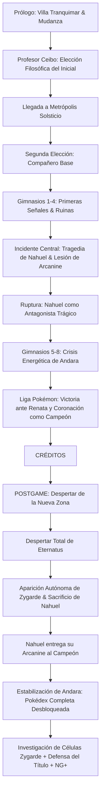

# ============================================================
# POKÉMON: ECOS DE ANDARA — PROYECTO FAN GAME
# DOCUMENTO MAESTRO DE HISTORIA Y LORE
# ============================================================

## 1. Ficha Técnica y Concepto General

* **Título Oficial:** **Pokémon: Ecos de Andara**
* **Región:** Andara (Inspirada en la riqueza geográfica, biológica y cultural de Sudamérica).
* **Organización Antagonista:** **Proyecto Aurora** (Facción conservacionista/ecológica vs Facción extremista de purificación "Aurora Cero").
* **Pueblo Inicial:** **Villa Tranquimar** (Pueblo costero pintoresco con salida al mar y vibra nostálgica estilo Kanto).
* **Capital Regional:** **Metrópolis Solsticio** (Gran ciudad costera y moderna al pie de la cordillera, centro económico y científico de Andara).
* **Profesor Pokémon:** **Profesor Ceibo** (Etología y energía de la tierra).
* **Rival Principal:** **Nahuel** (Compañero desde la niñez en Villa Tranquimar).
* **Pokémon Insignia del Rival:** **Growlithe $\rightarrow$ Arcanine** (Vínculo de lealtad incondicional).
* **Campeona de la Liga:** **Renata** (Guardiana de la cordillera, viste poncho andino y comanda a **Mega-Garchomp**).
* **Mecánica Especial Exclusiva:** **Mega Evolución** (Única mecánica especial presente; asociada a las venas telúricas de Andara y al lazo entrenador-Pokémon).
* **Género:** RPG / Aventura / Exploración / Colección / Combate estratégico.
* **Plataforma:** PC Windows (Modo Offline .exe / HD-2.5D).

---

## 2. Geografía y Ecosistemas de Andara

Andara representa un continente de contrastes extremos:
* **Cordilleras y Altiplanos:** Cumbres nevadas, volcanes activos y pasos de montaña escarpados (hábitat de tipos Roca, Hielo, Acero y Volador).
* **Selvas y Bosques Tropicales:** Densas junglas con vegetación exótica, ríos caudalosos y ruinas ancestrales (hábitat de tipos Planta, Bicho, Veneno y Psíquico).
* **Desiertos y Salfarras:** Zonas áridas de alta radiación solar y noches heladas (hábitat de tipos Tierra, Fuego y Fantasma).
* **Costas y Ciudades Portuarias:** Bahías marítimas, arrecifes y centros comerciales pesqueros (hábitat de tipos Agua y Eléctrico).
* **Grandes Metrópolis Modernas y Pueblos Históricos:** Contrastes entre tecnología de vanguardia y arquitectura tradicional con vestigios de civilizaciones milenarias.

---

## 3. Pilares Temáticos

1. **Amistad y Rivalidad Orgánica:** El rival es el mejor amigo del protagonista; su rivalidad surge del deseo mutuo de superación, no del odio.
2. **Libertad y Convivencia:** Crítica a ver a los Pokémon como simples herramientas de combate, explorando la relación simbiótica humano-Pokémon.
3. **El Peligro de los Extremos:** La facción radical del Team Villano y el propio descenso del rival demuestran cómo intentar hacer el "bien" a través del extremismo puede desatar catástrofes.
4. **Equilibrio Ecológico (Eternatus & Zygarde):** La energía desmedida y caótica de Eternatus frente a la fuerza reguladora y silenciosa del equilibrio universal personificada en Zygarde.
5. **Consecuencias Reales y Crecimiento:** Las acciones dejan huellas permanentes: el mundo cambia tras los créditos, los personajes sufren lesiones reales y el legado trasciende.

---

## 4. Lugares y Facciones Principales

### 4.1. Villa Tranquimar (El Pueblo Costero Inicial)
* **Estilo Visual:** Inspirado en la tranquilidad y simpleza de Pueblo Paleta / Kanto, pero con un toque marítimo sudamericano (casas con tejas cálidas, pequeñas caletas de pescadores, brisa marina constante y gaviotas Wingull sobrevolando el muelle).
* **Atmósfera:** Representa la inocencia, el hogar y los recuerdos de infancia del protagonista y su rival corriendo junto a su pequeño Growlithe por la orilla de la playa.
* **Punto de Partida:** La familia del protagonista prepara las maletas para mudarse a la gran metrópolis por motivos laborales.

### 4.2. Metrópolis Solsticio (La Capital de Andara)
* **Estilo Visual:** Una imponente metrópolis moderna construida entre la costa y las faldas de la cordillera andina. Cuenta con rascacielos vanguardistas, jardines botánicos verticales, un tranvía panorámico y el gran Laboratorio de Investigación Ecológica.
* **Función:** Es donde el protagonista y el rival se inscriben formalmente en la Liga de Andara y el jugador recibe su segundo compañero en su etapa base.

### 4.3. Proyecto Aurora (La Organización Antagonista)
* **Fachada y Origen:** Inició como una prestigiosa ONG y movimiento de conservación ambiental en Andara, dedicada a proteger hábitats vulnerables, rescatar Pokémon explotados e investigar la flora y fauna nativa.
* **División Interna:**
  * **Facción Moderada (Dra. Clara):** Integrada por ecólogos, guardaparques y veterinarios que creen en la educación y la coexistencia armónica.
  * **Facción Radical ("Aurora Cero" - Alister):** Creen que la sociedad humana es un parásito incurable para el equilibrio natural y deciden usar la profecía ancestral de Eternatus para provocar una purificación radical del sistema.

### 4.4. La Reserva Ecológica de Andara (Mecánica Zona Safari)
* **Concepto:** Un vasto santuario protegido gestionado por guardaparques y biólogos de Andara con microclimas artificiales y naturales (invernadero botánico, faldas volcánicas y lagunas costeras).
* **Mecánica de Exploración y Captura:**
  * **Sin límite de pasos ni cronómetro:** El jugador puede explorar el parque con libertad y tranquilidad.
  * **Acceso con Entrada:** El jugador paga una tarifa en dinero y recibe una **cantidad fija de Safari Balls (ej. 30 unidades)**.
  * **Condición de Salida:** La sesión en la reserva finaliza únicamente cuando se agotan todas las Safari Balls o cuando el jugador decide retirarse voluntariamente.
  * **Obtención de Iniciales:** Es el lugar predilecto donde habitan todos los Pokémon iniciales de todas las generaciones que no fueron elegidos en Villa Tranquimar.

---

## 5. Personajes Principales

### 5.1. El Profesor Pokémon: Profesor Ceibo
* **Especialidad:** Etología Pokémon, migración de especies y resonancia de la energía de la tierra con las Mega Piedras.
* **Personalidad:** Investigador de campo entusiasta y cercano. En Villa Tranquimar plantea la pregunta filosófica que define el tipo de tu inicial y te entrega la Pokédex regional.

### 5.2. El Rival: Nahuel
* **Compañero Insignia:** **Growlithe $\rightarrow$ Arcanine** (su fiel protector desde la niñez en Villa Tranquimar).
* **Equipo Dinámico:** Captura Pokémon de las rutas que recorre. Su equipo cambia en cada partida manteniendo equilibrio de tipos.
* **Arco:** Amigo fraternal $\rightarrow$ Tragedia de Arcanine $\rightarrow$ Antagonista temporal con ideales de rescate radical $\rightarrow$ Sacrificio heroico y legado de su Arcanine al Campeón en el postgame.

### 5.3. La Campeona de Andara: Renata
* **Concepto:** Una mujer imponente, sabia y respetada en todo el continente. Viste un poncho andino estilizado con bordados ceremoniales y botas de alta montaña. En lugar de estar aislada en la Liga, recorre la cordillera protegiendo pueblos y ecosistemas de las catástrofes.
* **Pokémon Insignia:** **Mega-Garchomp** (creció junto a ella en los altiplanos de Andara).
* **Equipo de la Liga (Nivel 62-65):**
  * *Garchomp (Mega-Garchomp)* (Dragón/Tierra) - Insignia
  * *Corviknight* (Volador/Acero)
  * *Milotic* (Agua)
  * *Volcarona* (Bicho/Fuego)
  * *Lucario* (Lucha/Acero)
  * *Gardevoir* (Psíquico/Hada)

---

## 6. Progresión de los 8 Gimnasios de Andara

Los líderes de gimnasio escalan su cantidad de Pokémon y nivel a lo largo de la aventura:

* **Gimnasios 1 y 2:** 2 a 3 Pokémon (Niveles 13-22) — Aprendizaje y coberturas.
* **Gimnasios 3 y 4:** 4 Pokémon (Niveles 27-37) — Estrategias y objetos equipados.
* **Gimnasios 5 y 6:** 4 a 5 Pokémon (Niveles 41-49) — Introducción de las primeras Mega Evoluciones en combate.
* **Gimnasios 7 y 8:** 5 Pokémon completos (Niveles 50-57) — Equipos competitivos con clima y Mega Evolución.
* **Revanchas de Postgame (Defensa de Título):** Equipos completos de 6 Pokémon (Niveles 80-90).

### Tabla de Gimnasios y Equipos

| # | Ciudad y Bioma | Líder | Tipo | Nivel | Equipo Propuesto (Historia Principal) |
|---|---|---|---|---|---|
| **1** | **Pueblo Altiplano** (Salar / Desierto) | **Rocío** | Tierra / Roca | Nv. 13-15 | *Geodude (Alola), Sandile, Hippopotas (Ace)* |
| **2** | **Villa Yungas** (Valles y Cafetales) | **Thiago** | Bicho / Planta | Nv. 19-22 | *Sewaddle, Yanma, Scyther (Ace)* |
| **3** | **Puerto Coralina** (Costa y Arrecife) | **Marina** | Agua | Nv. 27-30 | *Tentacool, Lanturn, Quagsire, Poliwrath (Ace)* |
| **4** | **Ciudad Condorina** (Ruinas Ancestrales) | **Inti** | Psíquico / Fantasma | Nv. 34-37 | *Xatu, Dusclops, Sigilyph, Medicham (Ace)* |
| **5** | **Metrópolis Solsticio** (Capital Andina) | **Valeria** | Eléctrico / Acero | Nv. 41-44 | *Magnemite $\rightarrow$ Magnezone, Galvantula, Steelix, **Mega-Ampharos (Ace)*** |
| **6** | **Cuenca Esmeralda** (Selva Amazónica) | **Kael** | Veneno / Lucha | Nv. 46-49 | *Drapion, Toxicroak, Roserade, Hawlucha, **Mega-Venusaur (Ace)*** |
| **7** | **Paso Vulcania** (Volcanes Andinos) | **Damián** | Fuego | Nv. 50-53 | *Torkoal (Sequía), Talonflame, Darmanitan, Chandelure, **Mega-Houndoom (Ace)*** |
| **8** | **Cumbres Australes** (Glaciares del Sur) | **Silvana** | Hielo / Dragón | Nv. 54-57 | *Weavile, Mamoswine, Kingdra, Dragonite, **Mega-Altaria / Mega-Glalie (Ace)*** |

---

## 7. El Alto Mando de Andara (Estrategia Competitiva Monotipo)

A diferencia de las ligas tradicionales donde los líderes se limitan a spamear ataques del mismo tipo, el Alto Mando de Andara utiliza **sinergias competitivas** (climas, trampas, coberturas de debilidades mediante tipos secundarios e ítems estratégicos) manteniendo una línea monotipo:

### 7.1. Alto Mando 1: Nayra — Tipo FANTASMA (Control, Trampas y Desgaste)
* **Concepto:** Chamán y custodia de la cosmovisión andina de los espíritus.
* **Estrategia:** Desactiva atacantes físicos con Fuego Fatuo, coloca trampas y bloquea estrategias rivales con *Espejo Mágico*.
* **Equipo (Niveles 58-60 / Postgame 85-88):**
  1. *Cofagrigus / Runerigus* — (Líder / *Lead*): Coloca Trampa Rocas, Espacio Raro y Fuego Fatuo.
  2. *Mimikyu* — Habilidad *Disfraz* (garantiza sobrevivir un golpe), Danza Espada, Carantoña, Sombra Vil.
  3. *Chandelure* — Habilidad *Absorbe Fuego* (inmunidad al fuego), Pañuelo Elección, Bola Sombra, Lanzallamas.
  4. *Gengar* — Banda Focus, Bomba Lodo (anti-Hada), Onda Certera (anti-Siniestro y Acero), Mismo Destino.
  5. *Aegislash* — Seguro Debilidad, Cambio de Postura, Escudo Real, Espada Santa, Sombra Vil.
  6. ***Mega-Sableye (Ace)*** — Habilidad *Espejo Mágico* (rebota mofas, cambios de estado y trampas), Recuperación, Fuego Fatuo, Desarme, Paz Mental.

### 7.2. Alto Mando 2: Marcos — Tipo ACERO (Hazards y Muralla Física)
* **Concepto:** Ingeniero en jefe de los yacimientos minerales y ferroviarios andinos.
* **Estrategia:** Anula las debilidades naturales del tipo Acero (Fuego/Tierra/Lucha) mediante combinaciones secundarias y la habilidad *Absorbe Fuego*.
* **Equipo (Niveles 59-61 / Postgame 86-89):**
  1. *Skarmory* — (Líder / *Lead*): Robustez, Púas, Pájaro Osado, Respiro, Remolino (inmune a Tierra y resistente a Lucha).
  2. *Heatran* — Habilidad *Absorbe Fuego* (convierte ataques de fuego en un potenciador), Tierra Viva, Humareda, Foco Resplandor.
  3. *Excadrill* — Rompemoldes, Terremoto, Cabeza de Hierro, Giro Rápido (limpia el campo).
  4. *Ferrothorn* — Casco Dentado, Punta Acero, Drenadoras, Onda Trueno, Giro Bola (muro mixto anti-Agua/Tierra).
  5. *Lucario* — Vidasfera, A Bocajarro, Puño Meteoro, Triturar, Velocidad Extrema.
  6. ***Mega-Scizor (Ace)*** — Habilidad *Experto*, Puño Bala prioritario, Danza Espada, Respiro, Desarme.

### 7.3. Alto Mando 3: Lautaro — Tipo AGUA (Rain Offense & Swift Swim)
* **Concepto:** Capitán de expedición de los fiordos australes y ríos caudalosos.
* **Estrategia:** Despliega Lluvia inmediata con *Llovizna*, duplicando la velocidad de sus atacantes y anulando debilidades a Planta y Eléctrico con tipos secundarios.
* **Equipo (Niveles 60-62 / Postgame 87-90):**
  1. *Pelipper* — Habilidad *Llovizna* (activa lluvia 5 turnos), Vendaval (100% precisión), Escaldar, Ida y Vuelta.
  2. *Gastrodon* — Habilidad *Colector* (inmunidad total a ataques de tipo Eléctrico y absorbe Agua), Recuperación, Rayo Hielo, Tierra Viva.
  3. *Toxapex* — Lodo Negro, Habilidad *Regenerador*, Tóxico, Recuperación, Niebla Tóxica (frena boosts rivales).
  4. *Ludicolo* — Nado Rápido, Vidasfera, Gigadrenado (anula otros tipos Agua/Tierra), Rayo Hielo (anti-Planta/Dragón).
  5. *Kingdra* — Nado Rápido, Gafas Elegidas, Hidrobomba demoledora bajo lluvia, Pulso Dragón, Rayo Hielo.
  6. ***Mega-Swampert (Ace)*** — Nado Rápido (velocidad extrema en lluvia), Cascada, Terremoto STAB, Puño Hielo, Fuerza Bruta.

### 7.4. Alto Mando 4: Ezequiel — Tipo DRAGÓN / VOLADOR (Tailwind & Dragon Dance)
* **Concepto:** Ermitaño y guardián de las cumbres más inaccesibles de la cordillera.
* **Estrategia:** Multiplica la velocidad con *Viento Afín (Tailwind)* y destruye counters de Hielo/Hada con movimientos de Acero, Fuego y Veneno.
* **Equipo (Niveles 61-63 / Postgame 88-91):**
  1. *Noivern* — (Líder / *Lead*): Habilidad *Allanamiento*, Viento Afín (Tailwind), Cometa Draco, Mofa, Lanzallamas (anti-Hielo).
  2. *Dragapult* — Pañuelo Elección, Flechas Dragón, Bola Sombra, Lanzallamas, Ida y Vuelta.
  3. *Kommo-o* — Baya Rimoya, Alma Dragón (*Clangorous Soul*), A Bocajarro, Cabeza de Hierro (anti-Hada), Puño Drenaje.
  4. *Hydreigon* — Levitación, Pulso Umbrío, Tierra Viva, Foco Resplandor (anti-Hada y Roca).
  5. *Dragonite* — Habilidad *Compensación (Multiscale)*, Seguro Debilidad, Danza Dragón, Velocidad Extrema, Puño Fuego.
  6. ***Mega-Salamence (Ace)*** — Habilidad *Piel Celeste*, Danza Dragón, Doble Filo / Retribución aérea, Terremoto, Respiro.

---

## 8. Sistema Exclusivo: Mega Evolución en Andara

Para preservar la pureza estratégica y el foco emocional sin sobrecargar con mecánicas adicionales (sin Dinamax ni Teracristalización en la trama principal), la **Mega Evolución** es la única mecánica especial de combate en Andara:

* **Lore Regional:** Las Mega Piedras no cayeron de meteoritos lejanos; en Andara se formaron en las profundidades de la cordillera andina debido a la antiquísima presión geológica y la resonancia con las líneas de energía del planeta (las mismas que Zygarde vigila).
* **Conexión Emocional:** La Mega Evolución no se activa con simples máquinas; exige un vínculo de confianza absoluta entre el entrenador y su compañero Pokémon.
* **Momentos Clave:**
  * El protagonista y el rival despiertan la Mega Evolución tras superar una prueba de sincronización en las ruinas cordilleranas.
  * Los últimos Líderes de Gimnasio, el Alto Mando completo, la Campeona Renata y los retadores del Endgame utilizan Mega Evoluciones en sus combates decisivos.

---

## 8. Cronología y Estructura de la Trama

---

## 9. Los Legendarios del Conflicto

### 9.1. Eternatus (El Catalizador del Caos)
* Despertado por la facción radical del Proyecto Aurora bajo la creencia de una profecía de purificación y liberación.
* Fuerza incontrolable que altera el clima, los hábitats y la geología regional, originando la "Nueva Zona" tras su contención inicial.

### 9.2. Zygarde (El Observador Silencioso del Equilibrio)
* **Comportamiento Único:** No responde a invocaciones, máquinas ni capturas durante la trama.
* Observa los acontecimientos a través de sus células y manifestaciones en las sombras.
* Interviene por **decisión propia** cuando la existencia misma del ecosistema de Andara está al borde del colapso ante Eternatus.
* En el postgame, tras cumplir su labor reguladora, el jugador puede emprender una investigación para rastrearlo y ganarse su respeto en combate para capturarlo.

---

## 11. Clímax Emocional, Endgame y New Game+ (NG+)

### 11.1. El Legado de Nahuel
Tras quedar incapacitado físicamente para competir al más alto nivel tras su heroico sacrificio contra Eternatus, Nahuel entrega la Poké Ball de su compañero más preciado al Campeón:
> *"No significa que haya dejado de ser mío. Significa que quiero que siga viajando... y sé que contigo estará bien."*
Arcanine pasa a ser un compañero permanente con recuerdos de su antiguo entrenador, desbloqueando eventos narrativos de afinidad.

### 11.2. Sistema de Defensa del Título de Campeón (Endgame)
Al ser coronado Campeón, el jugador recibe alertas en el Pokégear/Smartphone cuando aspirantes de alto rango desafían el trono en la Liga:
* **Entrenadores Legendarios y Aspirantes:** Equipos con IVs perfectos, EVs entrenados y niveles 80-100.
* **Revanchas de los 8 Líderes de Gimnasio:**
  * Todos los Líderes acuden a la Liga con **Roster Completo de 6 Pokémon** (Niveles 80-88).
  * **Mega Evolución garantizada** en su Pokémon insignia.
  * Estrategias competitivas de objetos (Vidasfera, Bandas Focus, Pañuelos Elección) y coberturas avanzadas.
* **El Alto Mando y la Excampeona Renata:** Desafían con equipos perfeccionados de niveles 88-95 con Mega-Garchomp, Mega-Salamence, Mega-Swampert, Mega-Scizor y Mega-Sableye.

### 11.3. New Game+ (NG+)
El modo New Game+ no es una simple repetición vacía; es una experiencia de maestría:
* **Escalado Global de Dificultad:** Los Líderes de Gimnasio, rivales y el Proyecto Aurora utilizan sus composiciones completas y niveles superiores desde el inicio si el jugador activa el "Modo Desafío NG+".
* **Retención de Datos:** Conserva la Pokédex desbloqueada, el registro de victorias, trajes especiales de Campeón y acceso a Mega Piedras raras.
* **Diálogos Contextuales:** Ciertos NPCs clave (el Profesor Ceibo, Renata, Nahuel) tienen líneas de diálogo exclusivas que reconocen tu aura de maestría y experiencia previa.
