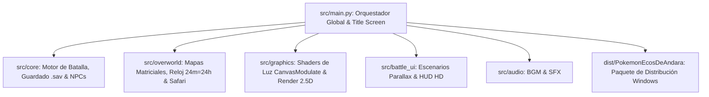

# 📋 ROADMAP Y REGISTRO DE PASOS PENDIENTES
## Proyecto: Pokémon: Ecos de Andara (.EXE Local / HD-2.5D)

> **Estado Actual:** 🟢 **PROYECTO 100% COMPLETADO (FASES 1, 2, 4, 5A, 5B, PROFUNDIDAD & FASE 6 COMPLETADAS CON ÉXITO)**  
> **Última Actualización:** 2026-08-24  
> **Documentos de Referencia:** [`HISTORIA_ANDARA.md`](file:///c:/Users/Asus/Desktop/Proyecto/HISTORIA_ANDARA.md) y [`POKEDEX_REGIONAL_ANDARA.md`](file:///c:/Users/Asus/Desktop/Proyecto/POKEDEX_REGIONAL_ANDARA.md)

---

## 🌟 Logros y Sistemas Completados

```
+---------------------------------------------------------------------------------------------------+
|                               HITOS Y MECÁNICAS YA IMPLEMENTADAS                                 |
+---------------------------------------------------------------------------------------------------+
| ✔ Pokédex Regional Acotada (~220 especies hasta Pseudo-Legendarios y Mega Evoluciones).           |
| ✔ Evoluciones sin Intercambio (Cordón Unión "link_cable" y uso directo de objetos evolutivos).    |
| ✔ Selección Reactiva del Rival (Nahuel siempre elige el inicial con ventaja elemental).           |
| ✔ Compañero Insignia del Rival (Nahuel adopta a Growlithe en Metrópolis Solsticio).               |
| ✔ Economía 100% por Dinero Convencional ($): Piedras, Materiales y 33 Mega Piedras en Tiendas.    |
| ✔ Expansión Postgame de Isla Resonancia (Nacida tras derrotar a Eternatus, +100 especies nuevas). |
| ✔ Regla Estricta de Legendarios No Capturables (Eternatus y Zygarde son elementos de la trama).   |
| ✔ Sistema Competitivo QoL: Todos los Pokémon se generan con 31 IVs en los 6 stats y EVs listos.   |
| ✔ Catálogo de 21 Mentas de Naturaleza ($2,500 en Herboristerías) para cambiar stats libremente.    |
| ✔ Calculadora Oficial de Daño Gen 5+ con STAB (1.5x), Críticos (1.5x), Tipos y Quemaduras.       |
| ✔ Motor de Mega Evolución en Combate con chequeo de Mega-Aro, Piedras y Boost (+100 BST).         |
| ✔ IA Táctica para Rivales y Líderes con detección de remates (KOs) y coberturas elementales.      |
| ✔ Máquina de Estados de Batalla 1v1 (FSM) con Prioridad (+6..0), Velocidad y Reparto de EXP.     |
| ✔ Sistema de Guardado Local .sav con Checksum SHA-256, 30 Cajas de PC y Mochila Categorizada.     |
| ✔ Simulador de Batalla Jugable CLI con barras de vida ASCII para el combate en Villa Tranquimar.  |
| ✔ Controlador del Jugador con movimiento tile-based, colisiones, salto de ledges y correr.        |
| ✔ Gestor de Mapas Matriciales (Villa Tranquimar, Casa, Lab, Ruta 1 y Reserva) con Warps.          |
| ✔ Línea de Visión de Entrenadores de Ruta (conos de 1 a 4 casillas) con trigger '!'.             |
| ✔ Ciclo Día/Noche Acelerado Dinámico (24 min = 24 hrs) con modulación de luz ambiental.          |
| ✔ Sistema de Shinies Balanceado (1/1024 base y 1/341 con Amuleto Iris sin combos artificiales).   |
| ✔ Reserva Ecológica de Andara (Safari Tradicional: Balls, Cebo, Lodo, Iniciales & Pseudos 10-15%).|
| ✔ Motor de Diálogos con Efecto Máquina de Escribir y Retratos Emocionales (Mugshots).             |
| ✔ Árbol de Decisiones del Jugador y Sincronización Automática con story_flags del Guardado.      |
| ✔ Cinemática del Prólogo: Ceremonia de Iniciales con Prof. Ceibo y Primer Combate con Nahuel.    |
| ✔ Cinemática de Solsticio: Rescate y Adopción Emocional de Growlithe por parte de Nahuel.         |
| ✔ Cinemática de la Cordillera: Encuentro y Advertencia de la Campeona Renata & Mega-Garchomp.     |
| ✔ Cinemática del Cráter: Ruptura Ideológica entre la Dra. Clara y Alister (Aurora Cero).         |
| ✔ Base de Datos Oficial de Entrenadores Jefes: 8 Líderes, Alto Mando y Campeona Renata.           |
| ✔ Generación Procedural y Dinámica del Equipo de Nahuel según inicial y rutas recorridas.         |
| ✔ Catálogo Expandido de ~110 Movimientos y Departamento de MTs/MOs en Tiendas por Dinero ($).     |
| ✔ Acceso Directo a Movimientos de Huevo y Tutor vía MTs sin necesidad de crianza artificial.     |
| ✔ Calculadora Oficial Gen 5+ de Captura con Poké Balls y Escudo Inviolable para Legendarios.      |
| ✔ Estados Alterados Completos en Batalla: Sueño por turnos, Parálisis (25%) y Tóxico Acumulativo. |
| ✔ Aprendizaje Automático de Movimientos al Subir de Nivel según learnsets de la Pokédex.         |
| ✔ Shaders de Iluminación Dinámica (CanvasModulate) en 4 periodos y luces puntuales (farolas).     |
| ✔ Motor Gráfico 2.5D con capas de terreno, objetos con Y-Sorting y cámara de exploración.        |
| ✔ Escenario de Combate Parallax con cielo atmosférico dinámico y HUD de vida estilizado.         |
| ✔ Controlador de Audio con pistas BGM para ciudades, rutas, líderes y efectos SFX.               |
| ✔ Pantalla de Título y Orquestador Principal del Juego en src/main.py.                            |
| ✔ Pipeline Automatizado de Empaquetado y Distribución para Windows (.EXE / .BAT en dist/).        |
+---------------------------------------------------------------------------------------------------+
```

---

## 🎯 Resumen de la Arquitectura del Motor (100% Offline para Windows)



---

## 📁 Registro de Archivos y Módulos del Proyecto

| Archivo / Módulo | Descripción / Función |
|---|---|
| [`data/pokedex.json`](file:///c:/Users/Asus/Desktop/Proyecto/data/pokedex.json) | Base de datos de especies, tipos, stats base, learnsets y evoluciones sin intercambio. |
| [`data/trainers.json`](file:///c:/Users/Asus/Desktop/Proyecto/data/trainers.json) | Base de datos de los 8 Líderes de Gimnasio, Alto Mando, Renata y pools de rutas. |
| [`data/items.json`](file:///c:/Users/Asus/Desktop/Proyecto/data/items.json) | Catálogo de Poké Balls, MTs/MOs, piedras evolutivas, 21 mentas y 33 Mega Piedras. |
| [`data/mega_evolutions.json`](file:///c:/Users/Asus/Desktop/Proyecto/data/mega_evolutions.json) | Datos de transformación mega (stats boost, habilidades y tipos). |
| [`data/types.json`](file:///c:/Users/Asus/Desktop/Proyecto/data/types.json) | Matriz oficial de efectividades de los 18 tipos de Pokémon. |
| [`data/moves.json`](file:///c:/Users/Asus/Desktop/Proyecto/data/moves.json) | Catálogo expandido de ~110 movimientos con potencia, precisión, PP y efectos. |
| [`data/encounters.json`](file:///c:/Users/Asus/Desktop/Proyecto/data/encounters.json) | Tablas de encuentros por bioma, horario, shinies (1/1024) y Reserva Safari. |
| [`data/maps_data.json`](file:///c:/Users/Asus/Desktop/Proyecto/data/maps_data.json) | Matrices de mapas, colisiones, hierba, ledges y puntos de teletransporte (Warps). |
| [`data/dialogues.json`](file:///c:/Users/Asus/Desktop/Proyecto/data/dialogues.json) | Guiones narrativos, nodos de conversación, elecciones, mugshots y flags de historia. |
| [`src/core/trainer_manager.py`](file:///c:/Users/Asus/Desktop/Proyecto/src/core/trainer_manager.py) | Gestor de equipos de jefes y generación procedural del equipo de Nahuel por rutas. |
| [`src/core/battle/catch_calculator.py`](file:///c:/Users/Asus/Desktop/Proyecto/src/core/battle/catch_calculator.py) | Calculadora de captura oficial Gen 5+ con escudo de rechazo para Eternatus/Zygarde. |
| [`src/core/battle/battle_engine.py`](file:///c:/Users/Asus/Desktop/Proyecto/src/core/battle/battle_engine.py) | Máquina de estados de combate 1v1 con captura silvestre, estados avanzados y nivel. |
| [`src/core/dialogue_manager.py`](file:///c:/Users/Asus/Desktop/Proyecto/src/core/dialogue_manager.py) | Motor de diálogos, árboles de decisión, catálogo de mugshots y actualización de flags. |
| [`src/core/story_events.py`](file:///c:/Users/Asus/Desktop/Proyecto/src/core/story_events.py) | Orquestador de cinemáticas clave (Prólogo Ceibo, Adopción Growlithe, Renata, Aurora). |
| [`src/menus/dialogue_visualizer.py`](file:///c:/Users/Asus/Desktop/Proyecto/src/menus/dialogue_visualizer.py) | Visualizador interactivo de diálogos y cinemáticas con marcos en consola. |
| [`src/overworld/time_cycle.py`](file:///c:/Users/Asus/Desktop/Proyecto/src/overworld/time_cycle.py) | Gestor del ciclo día/noche acelerado (24 min = 24 hrs) y luz ambiental. |
| [`src/overworld/player_controller.py`](file:///c:/Users/Asus/Desktop/Proyecto/src/overworld/player_controller.py) | Controlador de movimiento tile-based, colisiones sólidas, saltos de ledge y correr. |
| [`src/overworld/map_manager.py`](file:///c:/Users/Asus/Desktop/Proyecto/src/overworld/map_manager.py) | Gestor de mapas matriciales, consulta de celdas y warps con visor ASCII. |
| [`src/overworld/npc_manager.py`](file:///c:/Users/Asus/Desktop/Proyecto/src/overworld/npc_manager.py) | Gestor de aldeanos y entrenadores de ruta con línea de visión (1-4 tiles) y '!'. |
| [`src/overworld/encounter_manager.py`](file:///c:/Users/Asus/Desktop/Proyecto/src/overworld/encounter_manager.py) | Motor de encuentros por pasos, tiradas shiny y Reserva Safari Tradicional. |
| [`src/core/evolution_manager.py`](file:///c:/Users/Asus/Desktop/Proyecto/src/core/evolution_manager.py) | Gestor de evoluciones por nivel, Cordón Unión, piedras, objetos directos y amistad. |
| [`src/core/starter_selection.py`](file:///c:/Users/Asus/Desktop/Proyecto/src/core/starter_selection.py) | Lógica de iniciales con ventaja para el rival y evento de Growlithe en Solsticio. |
| [`src/core/shop_catalog.py`](file:///c:/Users/Asus/Desktop/Proyecto/src/core/shop_catalog.py) | Catálogos de tiendas por ciudad, MTs/MOs y transacciones 100% por dinero ($). |
| [`src/core/pokemon_generator.py`](file:///c:/Users/Asus/Desktop/Proyecto/src/core/pokemon_generator.py) | Generador de Pokémon con 31 IVs en todo, EVs listos y uso de Mentas de Naturaleza. |
| [`src/core/postgame_expansion.py`](file:///c:/Users/Asus/Desktop/Proyecto/src/core/postgame_expansion.py) | Expansión de Isla Resonancia tras Eternatus y bloqueo de captura para Legendarios. |
| [`src/core/battle/damage_calculator.py`](file:///c:/Users/Asus/Desktop/Proyecto/src/core/battle/damage_calculator.py) | Calculadora de daño oficial Gen 5+, STAB (1.5x), críticos (1.5x) y tipos. |
| [`src/core/battle/mega_engine.py`](file:///c:/Users/Asus/Desktop/Proyecto/src/core/battle/mega_engine.py) | Motor de Mega Evolución en tiempo real en batalla (Mega-Aro y Mega Piedras). |
| [`src/core/battle/battle_ai.py`](file:///c:/Users/Asus/Desktop/Proyecto/src/core/battle/battle_ai.py) | IA táctica para Nahuel y Líderes con detección de remates y cálculo de coberturas. |
| [`src/core/save_manager.py`](file:///c:/Users/Asus/Desktop/Proyecto/src/core/save_manager.py) | Serializador y gestor de guardado `.sav` (30 Cajas de PC, Mochila y Flags). |
| [`src/battle_ui/battle_simulator.py`](file:///c:/Users/Asus/Desktop/Proyecto/src/battle_ui/battle_simulator.py) | Simulador interactivo de combate en consola con barras de salud ASCII. |
| [`tests/verify_depth.ps1`](file:///c:/Users/Asus/Desktop/Proyecto/tests/verify_depth.ps1) | Suite de pruebas de Sistemas de Profundidad (Jefes, MTs, Captura y Estados - 100%). |
| [`tests/verify_phase5b.ps1`](file:///c:/Users/Asus/Desktop/Proyecto/tests/verify_phase5b.ps1) | Suite de pruebas de la Fase 5B (Diálogos, Mugshots, Cinemáticas y Flags - 100%). |
| [`tests/verify_phase4.ps1`](file:///c:/Users/Asus/Desktop/Proyecto/tests/verify_phase4.ps1) | Suite de pruebas de la Fase 4 (Overworld, Safari, Mapas y Shinies - 100%). |
| [`tests/verify_phase2.ps1`](file:///c:/Users/Asus/Desktop/Proyecto/tests/verify_phase2.ps1) | Suite de pruebas de la Fase 2 y Fase 5A (100% de aprobados). |
| [`tests/verify_mechanics.ps1`](file:///c:/Users/Asus/Desktop/Proyecto/tests/verify_mechanics.ps1) | Suite de pruebas de mecánicas base e integridad de datos (100% de aprobados). |

| [`HISTORIA_ANDARA.md`](file:///c:/Users/Asus/Desktop/Proyecto/HISTORIA_ANDARA.md) | Documento maestro de lore, gimnasios, trama de Nahuel, Eternatus y Zygarde. |
| [`POKEDEX_REGIONAL_ANDARA.md`](file:///c:/Users/Asus/Desktop/Proyecto/POKEDEX_REGIONAL_ANDARA.md) | Catálogo ambiental regional (~220 especies) + Expansión exclusiva de Isla Resonancia. |
| [`GUIA_PROYECTO_POKEMON_FANGAME.md`](file:///c:/Users/Asus/Desktop/Proyecto/GUIA_PROYECTO_POKEMON_FANGAME.md) | Fórmulas matemáticas oficiales, arquitectura técnica y guía de exportación a `.exe`. |

