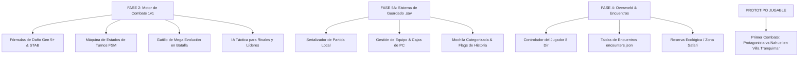

# 📋 ROADMAP Y REGISTRO DE PASOS PENDIENTES
## Proyecto: Pokémon: Ecos de Andara (.EXE Local / HD-2.5D)

> **Estado Actual:** 🟢 **FASE 1 & CORE DE DATOS COMPLETADOS — LISTO PARA FASE 2 (Motor de Combate & Guardado)**  
> **Última Actualización:** 2026-08-21  
> **Documentos de Referencia:** [`HISTORIA_ANDARA.md`](file:///c:/Users/Asus/Desktop/Proyecto/HISTORIA_ANDARA.md) y [`POKEDEX_REGIONAL_ANDARA.md`](file:///c:/Users/Asus/Desktop/Proyecto/POKEDEX_REGIONAL_ANDARA.md)

---

## 🌟 Logros y Sistemas Completados en la Sesión Actual

```
+---------------------------------------------------------------------------------------------------+
|                               HITOS Y MECÁNICAS YA IMPLEMENTADAS                                 |
+---------------------------------------------------------------------------------------------------+
| ✔ Pokédex Regional Acotada (~220 especies hasta Pseudo-Legendarios y Mega Evoluciones).           |
| ✔ Evoluciones sin Intercambio (Cordón Unión "link_cable" y uso directo de objetos evolutivos).    |
| ✔ Selección Reactiva del Rival (Nahuel siempre elige el inicial con ventaja elemental).           |
| ✔ Compañero Insignia del Rival (Nahuel adopta a Growlithe en Metrópolis Solsticio).               |
| ✔ Economía 100% por Dinero Convencional ($): Piedras, Materiales y 33 Mega Piedras en Tiendas.    |
| ✔ Expansión Postgame de Isla Resonancia (Nacida tras derrotar a Eternatus, +100 especies nuevas). |
| ✔ Regla Estricta de Legendarios No Capturables (Eternatus y Zygarde son elementos de la trama).   |
| ✔ Sistema Competitivo QoL: Todos los Pokémon se generan con 31 IVs en los 6 stats y EVs listos.   |
| ✔ Catálogo de 21 Mentas de Naturaleza ($2,500 en Herboristerías) para cambiar stats libremente.    |
| ✔ Módulos Core: evolution_manager.py, starter_selection.py, shop_catalog.py,                      |
|   pokemon_generator.py y postgame_expansion.py.                                                   |
+---------------------------------------------------------------------------------------------------+
```

---

## 🎯 Próximos Pasos a Seguir (Para la Próxima Sesión)

A continuación se detallan los 4 bloques principales preparados para abordar en las próximas sesiones de trabajo:



---

### ⚔️ BLOQUE 1: Motor de Combate por Turnos (Fase 2)
1. **Calculadora Oficial de Daño (`src/core/battle/damage_calculator.py`):**
   - Implementar la fórmula matemática oficial Gen 5+.
   - Multiplicadores de efectividad de tipos (`data/types.json`), STAB ($\times 1.5$), golpes críticos ($\times 1.5$), aleatoriedad ($0.85 - 1.00$) y penalización por quemadura.
   - Categorías de movimiento: Físico (Ataque vs Defensa), Especial (Atq. Esp vs Def. Esp) y Estado.
2. **Máquina de Estados de Batalla (`src/core/battle/battle_engine.py`):**
   - Flujo de turno: *Selección de Acción $\rightarrow$ Prioridad de Movimiento $\rightarrow$ Comparación de Velocidad $\rightarrow$ Ejecución $\rightarrow$ Consumo de PP $\rightarrow$ Check de Debilitamiento $\rightarrow$ Reparto de Experiencia y Subida de Nivel*.
3. **Mecánica de Mega Evolución en Combate (`src/core/battle/mega_engine.py`):**
   - Verificación de posesión del Mega-Aro y Mega Piedra equipada.
   - Transformación estética y ajuste de estadísticas/habilidades en tiempo real durante el turno.
4. **IA Táctica para Entrenadores (`src/core/battle/battle_ai.py`):**
   - Algoritmo de toma de decisiones para Nahuel, Líderes de Gimnasio y Alto Mando (evalúa coberturas de tipo, remates y cambios estratégicos).

---

### 💾 BLOQUE 2: Sistema de Guardado Local (`.sav`) y Gestión de Equipo/PC (Fase 5)
1. **Serializador y Guardado Local (`src/core/save_manager.py`):**
   - Guardar y cargar el estado completo del juego en un archivo `.sav` local independiente.
2. **Estructura de Datos Guardados:**
   - **Datos del Entrenador:** Nombre, ID, dinero ($), medallas de gimnasio y tiempo de juego.
   - **Equipo Activo:** Hasta 6 Pokémon con sus PS actuales, nivel, movimientos, IVs (31), EVs, naturaleza y objeto equipado.
   - **Cajas de PC:** Sistema de almacenamiento para Pokémon capturados.
   - **Inventario:** Bolsas categorizadas (*Objetos, Poké Balls, Medicina, Mentas de Naturaleza, Mega Piedras, Objetos Clave*).
   - **Flags de Progreso:** Estado de eventos de historia (entrega de inicial, adopción de Growlithe, gimnasios vencidos, derrota de Eternatus, desbloqueo de Isla Resonancia).

---

### 🗺️ BLOQUE 3: Overworld, Encuentros Salvajes y Mapas (Fase 4)
1. **Tablas de Encuentros por Bioma (`data/encounters.json`):**
   - Configuración de ratios de aparición para rutas, cuevas, agua y la Reserva Ecológica de Andara (Zona Safari sin límite de pasos).
2. **Controlador del Jugador y Entorno:**
   - Movimiento en 8 direcciones, aceleración al correr y detección de colisiones.
   - Sistema de línea de visión de entrenadores (`!`).

---

### 🎮 BLOQUE 4: Prototipo Jugable del Combate Inicial
* Crear un script interactivo en consola/interfaz para ejecutar y jugar en vivo la **Primera Batalla en Villa Tranquimar**:
  - *Protagonista (Inicial elegido)* vs *Rival Nahuel (Inicial con ventaja de tipo)*.
  - Opciones completas: *Luchar (4 movimientos), Mochila (Pociones), Pokémon y Huir*.

---

## 📁 Registro de Archivos del Proyecto

| Archivo / Módulo | Descripción / Función |
|---|---|
| [`data/pokedex.json`](file:///c:/Users/Asus/Desktop/Proyecto/data/pokedex.json) | Base de datos de especies, tipos, stats base, learnsets y evoluciones sin intercambio. |
| [`data/items.json`](file:///c:/Users/Asus/Desktop/Proyecto/data/items.json) | Catálogo de Poké Balls, medicinas, piedras evolutivas, 21 mentas y 33 Mega Piedras con precios en $. |
| [`data/mega_evolutions.json`](file:///c:/Users/Asus/Desktop/Proyecto/data/mega_evolutions.json) | Datos de transformación mega (stats boost, habilidades y tipos). |
| [`data/types.json`](file:///c:/Users/Asus/Desktop/Proyecto/data/types.json) | Matriz oficial de efectividades de los 18 tipos de Pokémon. |
| [`data/moves.json`](file:///c:/Users/Asus/Desktop/Proyecto/data/moves.json) | Catálogo de movimientos, potencia, precisión, PP y categoría. |
| [`src/core/evolution_manager.py`](file:///c:/Users/Asus/Desktop/Proyecto/src/core/evolution_manager.py) | Gestor de evoluciones por nivel, Cordón Unión, piedras, objetos directos y amistad. |
| [`src/core/starter_selection.py`](file:///c:/Users/Asus/Desktop/Proyecto/src/core/starter_selection.py) | Lógica de iniciales con ventaja para el rival y evento de Growlithe en Solsticio. |
| [`src/core/shop_catalog.py`](file:///c:/Users/Asus/Desktop/Proyecto/src/core/shop_catalog.py) | Catálogos de tiendas por ciudad y transacciones 100% por dinero tradicional ($). |
| [`src/core/pokemon_generator.py`](file:///c:/Users/Asus/Desktop/Proyecto/src/core/pokemon_generator.py) | Generador de Pokémon con 31 IVs en todo, EVs listos y uso de Mentas de Naturaleza. |
| [`src/core/postgame_expansion.py`](file:///c:/Users/Asus/Desktop/Proyecto/src/core/postgame_expansion.py) | Expansión de Isla Resonancia tras Eternatus y bloqueo de captura para Legendarios. |
| [`tests/verify_mechanics.ps1`](file:///c:/Users/Asus/Desktop/Proyecto/tests/verify_mechanics.ps1) | Suite automatizada de verificación de integridad y mecánicas (100% aprobada). |
| [`HISTORIA_ANDARA.md`](file:///c:/Users/Asus/Desktop/Proyecto/HISTORIA_ANDARA.md) | Documento maestro de lore, gimnasios, trama de Nahuel, Eternatus y Zygarde. |
| [`POKEDEX_REGIONAL_ANDARA.md`](file:///c:/Users/Asus/Desktop/Proyecto/POKEDEX_REGIONAL_ANDARA.md) | Catálogo ambiental regional (~220 especies) + Expansión exclusiva de Isla Resonancia. |
| [`GUIA_PROYECTO_POKEMON_FANGAME.md`](file:///c:/Users/Asus/Desktop/Proyecto/GUIA_PROYECTO_POKEMON_FANGAME.md) | Fórmulas matemáticas oficiales, arquitectura técnica y guía de exportación a `.exe`. |
